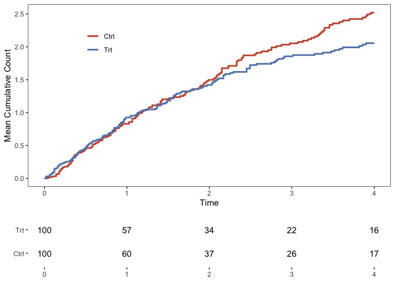

# Comparison of mean cumulative count curves via the area under the curve (AUC).

Zachary McCaw <br>
Updated: 2021-11-21


### Description

This package provides functions for inference on the difference and ratio in AUCs comparing two mean cumulative count (MCC) curves. The MCC curves are estimated using an approach based on the method of [Ghosh and Lin (2000)](https://onlinelibrary.wiley.com/doi/abs/10.1111/j.0006-341X.2000.00554.x) that accounts for the presence of terminal competing risks. Also see:

* [CICs](https://github.com/zrmacc/CICs) for comparing cumulative incidence curves. 

## Installation


```r
devtools::install_github(repo = 'zrmacc/MCC')
```

## Examples

### Data

The function `GenData` simulates example data in the format expected by this package. The recurrent event times are generated from a Poisson process that continues until censoring or death, whichever occurs first. Optionally, a `frailty_variance` may be specified such that the patient-specific event and death rates are correlated. The example data includes 100 patients in each of the treatment and control arms. The maximum duration of follow-up is `tau = 4`. The rate of recurrent events for patients in the treatment arm is 80% the rate for patients in the control arm. 


```r
library(MCC)
covariates <- data.frame(
  arm = c(rep(1, 100), rep(0, 100))
)
data <- MCC::GenData(
  beta_event = c(log(0.8)),
  covariates = covariates,
  frailty_variance = 0.2,
  tau = 4
)
head(data)
```

```
##   idx     time status arm true_death_rate true_event_rate   frailty
## 1   1 2.304577      1   1       0.2019836       0.6463474 0.8079343
## 2   1 2.348015      1   1       0.2019836       0.6463474 0.8079343
## 3   1 3.853470      1   1       0.2019836       0.6463474 0.8079343
## 4   1 4.000000      0   1       0.2019836       0.6463474 0.8079343
## 5   2 0.141309      1   1       0.2242638       0.7176442 0.8970553
## 6   2 1.123057      1   1       0.2242638       0.7176442 0.8970553
```

The essential data are:

* `idx`, the subject index. 
* `time`, the observation time. 
* `status`, coded 0 for censoring, 1 for an event, 2 for death (or any competing terminal event).
* `arm`, coded as 1 for treatment, 0 for reference. 

For analyzing other data sets, arm and status should have the same coding. Each subject should experience an observation-terminating event, i.e. either death or censoring. 

The example data also include:

* `true_death_rate`, the patient-specific terminal event rate, calculated as `frailty` x `base_death_rate` x `exp(covariates %*% beta_death)`. If omitted, `beta_death` is set to zero.
* `true_event_rate`, the patient-specific recurrent event rate, calculated as `frailty` x `base_event_rate` x `exp(covariates %*% beta_event)`. If omitted, `beta_event` is set to zero.
* `frailty`,the patient-specific frailty drawn from a gamma distribution with mean 1 and the specified variance. 

### Observation-terminating events 

In contrast to the time to first event setting, in the multiple or recurrent events setting, a subject may remain at risk after experiencing the event of interest. An *observation-terminating* event, either censoring or the occurrence of a competing risk, is therefore necessary to remove a subject from the risk set. Conversely, a subject who lacks an observation-terminating event is implicitly assumed to remain at risk indefinitely. If a subject *lacks* an observation-terminating event, then by default `CompareAUCs` will add a censoring time immediately after their last event of interest. For example, if the data for subject 1 is:

```
##   idx time status
## 1   1    2      1
## 2   1    3      1
## 3   1    5      1
```
then, for analysis, the subject's is assumed to be censored after the last event:

```
##   idx time status
## 1   1    2      1
## 2   1    3      1
## 3   1    5      1
## 4   1    5      0
```

If a subject who lacks an observation-terminating event should in fact remain at risk until the truncation time `tau`, either add an appropriate censoring time for that subject, or set `cens_after_last = FALSE` to retain that subject in the risk set indefinitely.

### Terminal events of interest

Suppose the endpoint of interest can include fatal events. One such example is the endpoint of heart failure hospitalization or CV-death. In this setting, it becomes necessary to distinguish non-fatal events of interest, after which the subject remains in the risk set, from fatal events of interest, after which the subject is removed from the risk set and precluded from having any future events of interest. To achieve this, fatal events of interest should be recorded using two records, both having the same value for `time`. The first, with `status = 1`, identifies that an event of interest has occurred. The second, with `status = 2`, indicates that the event was terminal. For example, the following data indicate that subject 1 had 3 events of interest, and the 3rd was terminal. 

```
##   idx time status
## 1   1    2      1
## 2   1    3      1
## 3   1    5      1
## 4   1    5      2
```

By contrast, the following data indicate that subject 2 had 3 events of interest, none of which was terminal:

```
##   idx time status
## 1   2    2      1
## 2   2    3      1
## 3   2    5      1
```

Note that, by default, subject 2 is assumed censoring after their 3rd event of interest, as in the following:

```
##   idx time status
## 1   2    2      1
## 2   2    3      1
## 3   2    5      1
## 4   2    5      0
```

Although censoring (`status = 0`) and a terminal event (`status = 2`) both remove a subject from the risk set, there is an important distinciton. Censoring leaves open the possibility that the subject experienced more events of interest in the future, which were unobserved, whereas a terminal event precludes the possiblity of any future events of interest.

### AUCs

To compare the areas under the mean cumulative count curves up to time $\tau = 4$: 

```r
aucs <- MCC::CompareAUCs(
  time = data$time,
  status = data$status,
  arm = data$arm,
  idx = data$idx,
  tau = 4,
  boot = TRUE,
  perm = TRUE,
  reps = 200,
  alpha = 0.05
)
show(aucs)
```

```
## Marginal Areas:
##   arm   n area    se tau
## 1   0 100 5.66 0.582   4
## 2   1 100 5.17 0.541   4
## 
## 
## CIs:
##       method contrast observed    se  lower upper
## 1 asymptotic    A1-A0   -0.494 0.795 -2.050  1.06
## 3  bootstrap    A1-A0   -0.494 0.828 -1.980  1.04
## 2 asymptotic    A1/A0    0.913 0.134  0.684  1.22
## 4  bootstrap    A1/A0    0.913 0.140  0.696  1.21
## 
## 
## P-values:
##        method contrast observed     p
## 1  asymptotic    A1-A0   -0.494 0.534
## 3   bootstrap    A1-A0   -0.494 0.567
## 5 permutation    A1-A0   -0.494 0.507
## 2  asymptotic    A1/A0    0.913 0.534
## 4   bootstrap    A1/A0    0.913 0.567
## 6 permutation    A1/A0    0.913 0.507
```

Here:

* `tau` is the truncation time, or the time up to which the AUC is calculated. 
* `boot` indicates to construct bootstrap confidence intervals. 
* `perm` indicates to perform permutation tests for the difference and ratio of AUCs.
* `reps` is the number of simulation replicates. 
  - The bootstrap is grouped by `idx`, and stratified by `strata`, if applicable.
* `alpha` is 1 minus the desired coverage for confidence intervals. 

#### Stratified Analysis

`CompareAUCs` also allows for stratified analysis. Consider a data set, similar to that described previously, but with the additional of a binary stratification factor. The event rate for individuals in stratum 1 is increased by 20%.


```r
# Generate data with strata.
covariates <- data.frame(
  arm = c(rep(1, 100), rep(0, 100)),
  strata = stats::rbinom(200, 1, 0.25)
)
data <- MCC::GenData(
  beta_event = c(log(0.8), log(1.2)),
  covariates = covariates,
  frailty_variance = 0.2,
  tau = 4
)

# Stratified AUC analysis.
aucs <- MCC::CompareAUCs(
  time = data$time,
  status = data$status,
  arm = data$arm,
  idx = data$idx,
  strata = data$strata,
  tau = 4,
  boot = TRUE,
  perm = TRUE,
  reps = 200,
  alpha = 0.05
)
show(aucs)
```

```
## Marginal Areas:
##   arm   n area    se tau
## 1   0 100 6.47 0.772   4
## 2   1 100 4.90 0.497   4
## 
## 
## CIs:
##       method contrast observed    se  lower   upper
## 1 asymptotic    A1-A0   -1.560 0.918 -3.360  0.2390
## 3  bootstrap    A1-A0   -1.560 0.864 -3.440 -0.0256
## 2 asymptotic    A1/A0    0.759 0.119  0.558  1.0300
## 4  bootstrap    A1/A0    0.759 0.111  0.552  0.9950
## 
## 
## P-values:
##        method contrast observed      p
## 1  asymptotic    A1-A0   -1.560 0.0891
## 3   bootstrap    A1-A0   -1.560 0.0597
## 5 permutation    A1-A0   -1.560 0.0697
## 2  asymptotic    A1/A0    0.759 0.0777
## 4   bootstrap    A1/A0    0.759 0.0597
## 6 permutation    A1/A0    0.759 0.0697
```

#### Outputs

The output of `CompareAUCs` is an object with these slots.

* `@StratumAreas` containing the stratum-specific AUCs for each arm.

```r
aucs@StratumAreas
```

```
##   arm strata  n tau     area var_area   se_area weight
## 1   0      0 75   4 6.221765 64.42236 0.9268035   0.75
## 2   0      1 25   4 7.197535 45.17633 1.3442667   0.25
## 3   1      0 75   4 4.839387 23.13924 0.5554486   0.75
## 4   1      1 25   4 5.099467 29.44611 1.0852853   0.25
```

* `@MargAreas` containing the AUCs for each arm, marginalized over any strata. 


```r
aucs@MargAreas
```

```
##   arm   n     area        se tau
## 1   0 100 6.465708 0.7720806   4
## 2   1 100 4.904407 0.4971514   4
```

* `@CIs` containing confindence intervals for the difference and ratio of AUCs.


```r
aucs@CIs
```

```
##       method contrast   observed        se      lower       upper
## 1 asymptotic    A1-A0 -1.5613009 0.9182963 -3.3611285  0.23852674
## 3  bootstrap    A1-A0 -1.5613009 0.8636273 -3.4374256 -0.02564877
## 2 asymptotic    A1/A0  0.7585259 0.1188121  0.5580101  1.03109521
## 4  bootstrap    A1/A0  0.7585259 0.1112598  0.5521597  0.99499372
```

* `@MCF` containing the per arm mean cumulative count curve, averaged across strata.


```r
head(aucs@MCF)
```

```
##           time  mcf     var_mcf     se_mcf arm
## 1 0.0002766509 0.00 0.000000000 0.00000000   1
## 2 0.0017186209 0.01 0.002400000 0.04898979   1
## 3 0.0070346207 0.02 0.009799964 0.09899477   1
## 4 0.0492532164 0.02 0.009799964 0.09899477   1
## 5 0.0506064633 0.03 0.016999857 0.13038350   1
## 6 0.0558741348 0.04 0.023999678 0.15491829   1
```

* `@Pvals` containing the bootstrap and permutation p-values.


```r
aucs@Pvals
```

```
##        method contrast   observed          p
## 1  asymptotic    A1-A0 -1.5613009 0.08909054
## 3   bootstrap    A1-A0 -1.5613009 0.05970149
## 5 permutation    A1-A0 -1.5613009 0.06965174
## 2  asymptotic    A1/A0  0.7585259 0.07765316
## 4   bootstrap    A1/A0  0.7585259 0.05970149
## 6 permutation    A1/A0  0.7585259 0.06965174
```

* `@Reps` is a list containing the bootstrap and permutation test statistics.

### Adjusted AUCs

The previous estimator allows for stratification, but a different approach is needed to accommodate continuous covariates. If covariates are provided, then `CompareAUCs` uses an augmentation estimator to adjust for differences between the treatment groups. Note that strata and covariates should not both be provided. If adjustment for both is needed, use `model.matrix` to generate a design matrix including both covariates and stratum indicators, e.g. `model.matrix(~ 0 + covar + strata, data = data)`, then supply the design matrix `covar` argument.


```r
# Generate data with a continuous covariate.
covariates <- data.frame(
  arm = c(rep(1, 100), rep(0, 100)),
  covar = stats::rnorm(200)
)
data <- MCC::GenData(
  beta_event = c(log(0.8), log(1.2)),
  covariates = covariates,
  frailty_variance = 0.2,
  tau = 4
)

aucs <- MCC::CompareAUCs(
  time = data$time,
  status = data$status,
  arm = data$arm,
  idx = data$idx,
  covar = data$covar,
  tau = 4,
  boot = TRUE,
  perm = TRUE,
  reps = 200,
  alpha = 0.05
)
show(aucs)
```

```
## Marginal Areas:
##   arm   n tau area    se
## 1   0 100   4 6.09 0.534
## 2   1 100   4 4.17 0.451
## 
## 
## CIs:
##       method contrast observed    se lower  upper
## 1 asymptotic    A1-A0    -2.02 0.694 -3.38 -0.665
## 2  bootstrap    A1-A0    -2.02 0.773 -3.46 -0.413
## 
## 
## P-values:
##        method contrast observed       p
## 1  asymptotic    A1-A0    -2.02 0.00351
## 2   bootstrap    A1-A0    -2.02 0.00995
## 3 permutation    A1-A0    -2.02 0.00995
```

### Plotting

The function `PlotMCFs` plots the mean cumulative count curves, comparing two treatment arms. Note that `data` must contain the column `arm`.


```r
q <- MCC::PlotMCFs(data)
show(q)
```


