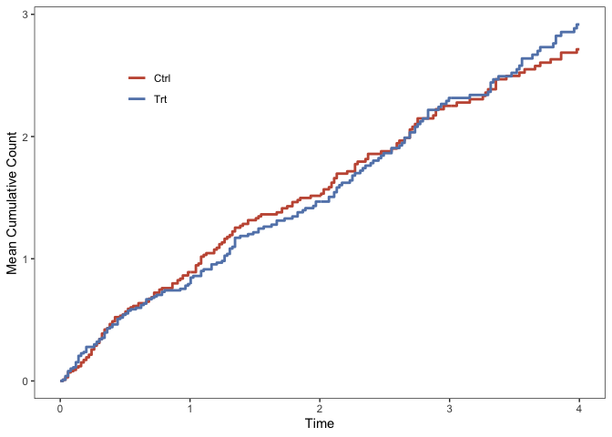

# Compare Mean Cumulative Count Curves

Zachary McCaw <br>
Updated: 2021-08-07


### Description

This package provides functions for inference on the difference and ratio in AUCs comparing two mean cumulative count (MCC) curves. The MCC curves are estimated using the method of [Ghosh and Lin (2000)](https://onlinelibrary.wiley.com/doi/abs/10.1111/j.0006-341X.2000.00554.x), which allows for the occurrence of terminal events such as death. Also see:

* [CICs](https://github.com/zrmacc/CICs) for comparing cumulative incidence curves. 

## Installation


```r
devtools::install_github(repo = 'zrmacc/MCC')
```

## Examples

### Data

The function `GenData` simulates example data in the format expected by this package. The recurrent event times are generated from a Poisson process that continues until censoring or death, whichever occurs first. Optionally, a `frailty_variance` may be specified such that the patient-specific event and death rates are correlated. The example data includes 100 patients in each of the treatment and control arms. The maximum duration of follow-up is `tau = 4`. The rate of recurrent events for patients in the treatment arm is 80% the rate for patients in the control arm. 


```r
library(MCC)
data <- MCC::GenData(
  n1 = 100,
  n0 = 100,
  frailty_variance = 0.2,
  treatment_effect = log(0.8),
  tau = 4
)
head(data)
```

```
##   idx      time status arm      covar strata true_event_rate   frailty
## 1   1 0.0384734      1   1  1.0142459      1       1.1919426 0.9505276
## 2   1 0.2945289      1   1  1.0142459      1       1.1919426 0.9505276
## 3   1 0.7683170      0   1  1.0142459      1       1.1919426 0.9505276
## 4   2 0.1150868      1   1 -0.6833771      0       0.9614766 1.3998285
## 5   2 1.0639391      0   1 -0.6833771      0       0.9614766 1.3998285
## 6   3 0.5764852      1   1  2.0503155      1       2.0573856 1.3020258
##   true_death_rate
## 1       0.2376319
## 2       0.2376319
## 3       0.2376319
## 4       0.3499571
## 5       0.3499571
## 6       0.3255065
```

The essential data are:

* `idx`, the subject index. 
* `time`, the observation time. 
* `status`, coded 0 for censoring, 1 for an event, 2 for death (or any competing terminal event).
* `arm`, coded as 1 for treatment, 0 for reference. 

For analyzing other data sets, arm and status should have the same coding. Each subject should experience an observation-terminating event, i.e. either death or censoring. If the last appearance of a subject in the data set has status 1, then a censoring time is added immediately after this recurrence. For example, if the data for subject 1 is:

```
##   idx time status
## 1   1    2      1
## 2   1    3      1
## 3   1    5      1
```
then, for analysis, the subject's is assumed to be censored after the last event:

```
##   idx time status
## 1   1    2      1
## 2   1    3      1
## 3   1    5      1
## 4   1    5      0
```

If instead the last recurrence is fatal, encode the input data as:

```
##   idx time status
## 1   1    2      1
## 2   1    3      1
## 3   1    5      1
## 4   1    5      2
```

The example data also include:

* `covar`, a standard normal covariate that decreases the event rate. 
* `strat`, a binary stratification factor that increases the event rate.
* `true_event_rate`, the patient-specific recurrent event rate.
* `frailty`,the patient-specific frailty drawn from a gamma distribution with mean 1 and the specified variance. 
* `true_death_rate`, the patient-specific death rate, equal to the overall death rate times the frailty. 

### AUCs

To compare the areas under the mean cumulative count curves up to time $\tau = 4$: 

```r
aucs <- MCC::CompareAUCs(
  time = data$time,
  status = data$status,
  arm = data$arm,
  idx = data$idx,
  strata = data$strata,
  tau = 4,
  boot = TRUE,
  perm = TRUE,
  reps = 200,
  alpha = 0.05
)
show(aucs)
```

```
## Marginal Areas:
##   arm   n area    se tau
## 1   0 100 6.22 0.724   4
## 2   1 100 5.94 0.682   4
## 
## 
## CIs:
##       method contrast observed    se  lower upper
## 1 asymptotic    A1-A0   -0.276 0.995 -2.230  1.67
## 3  bootstrap    A1-A0   -0.276 0.987 -2.160  1.69
## 2 asymptotic    A1/A0    0.956 0.156  0.694  1.32
## 4  bootstrap    A1/A0    0.956 0.160  0.707  1.33
## 
## 
## P-values:
##        method contrast observed     p
## 1  asymptotic    A1-A0   -0.276 0.781
## 3   bootstrap    A1-A0   -0.276 0.896
## 5 permutation    A1-A0   -0.276 0.766
## 2  asymptotic    A1/A0    0.956 0.781
## 4   bootstrap    A1/A0    0.956 0.896
## 6 permutation    A1/A0    0.956 0.776
```

Here:

* `tau` is the truncation time, or the time up to which the AUC is calculated. 
* `boot` indicates to construct bootstrap confidence intervals. 
* `perm` indicates to perform permutation tests for the difference and ratio of AUCs.
* `reps` is the number of simulation replicates. 
  - The bootstrap is grouped by `idx`, and stratified by `strata`, if applicable.
* `alpha` is 1 minus the desired coverage for confidence intervals. 

Note that the `strata` argument may be omitted for unstratified data. 

#### Outputs

The output of `CompareAUCs` is an object with these slots.

* `@StratumAreas` containing the stratum-specific AUCs for each arm.

```r
aucs@StratumAreas
```

```
##   arm strata  n tau     area var_area   se_area weight
## 1   0      0 80   4 6.169910 46.44172 0.7619196  0.785
## 2   0      1 20   4 6.391197 72.16467 1.8995350  0.215
## 3   1      0 77   4 5.108318 42.13942 0.7397737  0.785
## 4   1      1 23   4 8.981404 63.46855 1.6611750  0.215
```

* `@MargAreas` containing the AUCs for each arm, marginalized over any strata. 


```r
aucs@MargAreas
```

```
##   arm   n     area        se tau
## 1   0 100 6.217487 0.7242392   4
## 2   1 100 5.941031 0.6817598   4
```

* `@CIs` containing confindence intervals for the difference and ratio of AUCs.


```r
aucs@CIs
```

```
##       method contrast   observed        se      lower    upper
## 1 asymptotic    A1-A0 -0.2764552 0.9946451 -2.2259238 1.673013
## 3  bootstrap    A1-A0 -0.2764552 0.9865350 -2.1569580 1.688333
## 2 asymptotic    A1/A0  0.9555359 0.1562445  0.6935260 1.316531
## 4  bootstrap    A1/A0  0.9555359 0.1599824  0.7067549 1.331820
```

* `@MCF` containing the per arm mean cumulative count curve, averaged across strata.


```r
head(aucs@MCF)
```

```
##          time         mcf     var_mcf     se_mcf arm
## 1 0.007670539 0.009347826 0.001922401 0.04384519   1
## 2 0.013073871 0.009347826 0.001922401 0.04384519   1
## 3 0.014699690 0.009347826 0.001922401 0.04384519   1
## 4 0.021395138 0.019676773 0.010029221 0.10014600   1
## 5 0.022266388 0.030005721 0.017919859 0.13386508   1
## 6 0.038473398 0.039353547 0.019666812 0.14023841   1
```

* `@Pvals` containing the bootstrap and permutation p-values.


```r
aucs@Pvals
```

```
##        method contrast   observed         p
## 1  asymptotic    A1-A0 -0.2764552 0.7810557
## 3   bootstrap    A1-A0 -0.2764552 0.8955224
## 5 permutation    A1-A0 -0.2764552 0.7661692
## 2  asymptotic    A1/A0  0.9555359 0.7808912
## 4   bootstrap    A1/A0  0.9555359 0.8955224
## 6 permutation    A1/A0  0.9555359 0.7761194
```

* `@Reps` is a list containing the bootstrap and permutation test statistics.

### Adjusted AUCs

The previous estimator allows for stratification, but a different approach is needed to accommodate continuous covariates. If covariates are provided, then `CompareAUCs` uses an augmentation estimator to adjust for differences between the treatment groups. Note that strata and covariates should not both be provided. If adjustment for both is needed, use `model.matrix` to generate a design matrix including both covariates and stratum indicators, e.g. `model.matrix(~ 0 + covar + strata, data = data)`, then supply the design matrix `covar` argument.


```r
aucs <- MCC::CompareAUCs(
  time = data$time,
  status = data$status,
  arm = data$arm,
  idx = data$idx,
  covar = data$covar,
  tau = 4,
  boot = TRUE,
  perm = TRUE,
  reps = 200,
  alpha = 0.05
)
show(aucs)
```

```
## Marginal Areas:
##   arm   n tau area    se
## 1   0 100   4 6.19 0.701
## 2   1 100   4 6.12 0.720
## 
## 
## CIs:
##       method contrast observed    se lower upper
## 1 asymptotic    A1-A0    0.325 0.983 -1.60  2.25
## 2  bootstrap    A1-A0    0.325 1.020 -1.74  2.05
## 
## 
## P-values:
##        method contrast observed     p
## 1  asymptotic    A1-A0    0.325 0.741
## 2   bootstrap    A1-A0    0.325 0.776
## 3 permutation    A1-A0    0.325 0.896
```

### Plotting

The function `PlotMCFs` plots the mean cumulative count curves, comparing two treatment arms.


```r
q <- MCC::PlotMCFs(data)
show(q)
```


