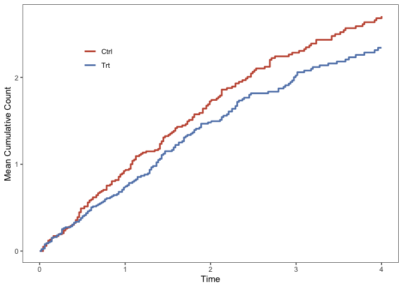

# Compare Mean Cumulative Count Curves

Zachary McCaw <br>
Updated: 2021-09-15


### Description

This package provides functions for inference on the difference and ratio in AUCs comparing two mean cumulative count (MCC) curves. The MCC curves are estimated using the method of [Ghosh and Lin (2000)](https://onlinelibrary.wiley.com/doi/abs/10.1111/j.0006-341X.2000.00554.x), which allows for the occurrence of terminal events such as death. Also see:

* [CICs](https://github.com/zrmacc/CICs) for comparing cumulative incidence curves. 

## Installation


```r
devtools::install_github(repo = 'zrmacc/MCC')
```

## Examples

### Data

The function `GenData` simulates example data in the format expected by this package. The recurrent event times are generated from a Poisson process that continues until censoring or death, whichever occurs first. Optionally, a `frailty_variance` may be specified such that the patient-specific event and death rates are correlated. The example data includes 100 patients in each of the treatment and control arms. The maximum duration of follow-up is `tau = 4`. The rate of recurrent events for patients in the treatment arm is 80% the rate for patients in the control arm. 


```r
library(MCC)
covariates <- data.frame(
  arm = c(rep(1, 100), rep(0, 100))
)
data <- MCC::GenData(
  beta_event = c(log(0.8)),
  covariates = covariates,
  frailty_variance = 0.2,
  tau = 4
)
head(data)
```

```
##   idx      time status arm true_death_rate true_event_rate   frailty
## 1   1 0.7812179      1   1       0.1979635       0.6334831 0.7918539
## 2   1 1.8675515      1   1       0.1979635       0.6334831 0.7918539
## 3   1 3.7086377      1   1       0.1979635       0.6334831 0.7918539
## 4   1 4.0000000      0   1       0.1979635       0.6334831 0.7918539
## 5   2 0.2411106      1   1       0.2348890       0.7516449 0.9395562
## 6   2 0.3202443      2   1       0.2348890       0.7516449 0.9395562
```

The essential data are:

* `idx`, the subject index. 
* `time`, the observation time. 
* `status`, coded 0 for censoring, 1 for an event, 2 for death (or any competing terminal event).
* `arm`, coded as 1 for treatment, 0 for reference. 

For analyzing other data sets, arm and status should have the same coding. Each subject should experience an observation-terminating event, i.e. either death or censoring. If the last appearance of a subject in the data set has status 1, then a censoring time is added immediately after this recurrence. For example, if the data for subject 1 is:

```
##   idx time status
## 1   1    2      1
## 2   1    3      1
## 3   1    5      1
```
then, for analysis, the subject's is assumed to be censored after the last event:

```
##   idx time status
## 1   1    2      1
## 2   1    3      1
## 3   1    5      1
## 4   1    5      0
```

If instead the last recurrence is fatal, encode the input data as:

```
##   idx time status
## 1   1    2      1
## 2   1    3      1
## 3   1    5      1
## 4   1    5      2
```

The example data also include:

* `true_death_rate`, the patient-specific terminal event rate, calculated as `frailty` x `base_death_rate` x `exp(covariates %*% beta_death)`. If omitted, `beta_death` is set to zero.
* `true_event_rate`, the patient-specific recurrent event rate, calculated as `frailty` x `base_event_rate` x `exp(covariates %*% beta_event)`. If omitted, `beta_event` is set to zero.
* `frailty`,the patient-specific frailty drawn from a gamma distribution with mean 1 and the specified variance. 


### AUCs

To compare the areas under the mean cumulative count curves up to time $\tau = 4$: 

```r
aucs <- MCC::CompareAUCs(
  time = data$time,
  status = data$status,
  arm = data$arm,
  idx = data$idx,
  tau = 4,
  boot = TRUE,
  perm = TRUE,
  reps = 200,
  alpha = 0.05
)
show(aucs)
```

```
## Marginal Areas:
##   arm   n area    se tau
## 1   0 100 5.77 0.560   4
## 2   1 100 6.20 0.669   4
## 
## 
## CIs:
##       method contrast observed    se  lower upper
## 1 asymptotic    A1-A0    0.432 0.872 -1.280  2.14
## 3  bootstrap    A1-A0    0.432 0.891 -1.150  2.18
## 2 asymptotic    A1/A0    1.070 0.156  0.809  1.43
## 4  bootstrap    A1/A0    1.070 0.159  0.817  1.47
## 
## 
## P-values:
##        method contrast observed     p
## 1  asymptotic    A1-A0    0.432 0.621
## 3   bootstrap    A1-A0    0.432 0.746
## 5 permutation    A1-A0    0.432 0.597
## 2  asymptotic    A1/A0    1.070 0.619
## 4   bootstrap    A1/A0    1.070 0.746
## 6 permutation    A1/A0    1.070 0.597
```

Here:

* `tau` is the truncation time, or the time up to which the AUC is calculated. 
* `boot` indicates to construct bootstrap confidence intervals. 
* `perm` indicates to perform permutation tests for the difference and ratio of AUCs.
* `reps` is the number of simulation replicates. 
  - The bootstrap is grouped by `idx`, and stratified by `strata`, if applicable.
* `alpha` is 1 minus the desired coverage for confidence intervals. 

#### Stratified Analysis

`CompareAUCs` also allows for stratified analysis. Consider a data set, similar to that described previously, but with the additional of a binary stratification factor. The event rate for individuals in stratum 1 is increased by 20%.


```r
# Generate data with strata.
covariates <- data.frame(
  arm = c(rep(1, 100), rep(0, 100)),
  strata = stats::rbinom(200, 1, 0.25)
)
data <- MCC::GenData(
  beta_event = c(log(0.8), log(1.2)),
  covariates = covariates,
  frailty_variance = 0.2,
  tau = 4
)

# Stratified AUC analysis.
aucs <- MCC::CompareAUCs(
  time = data$time,
  status = data$status,
  arm = data$arm,
  idx = data$idx,
  strata = data$strata,
  tau = 4,
  boot = TRUE,
  perm = TRUE,
  reps = 200,
  alpha = 0.05
)
show(aucs)
```

```
## Marginal Areas:
##   arm   n area    se tau
## 1   0 100 5.90 0.542   4
## 2   1 100 4.95 0.560   4
## 
## 
## CIs:
##       method contrast observed    se  lower upper
## 1 asymptotic    A1-A0   -0.952 0.780 -2.480 0.577
## 3  bootstrap    A1-A0   -0.952 0.760 -2.520 0.463
## 2 asymptotic    A1/A0    0.839 0.122  0.630 1.120
## 4  bootstrap    A1/A0    0.839 0.121  0.625 1.090
## 
## 
## P-values:
##        method contrast observed     p
## 1  asymptotic    A1-A0   -0.952 0.222
## 3   bootstrap    A1-A0   -0.952 0.259
## 5 permutation    A1-A0   -0.952 0.229
## 2  asymptotic    A1/A0    0.839 0.228
## 4   bootstrap    A1/A0    0.839 0.259
## 6 permutation    A1/A0    0.839 0.229
```

#### Outputs

The output of `CompareAUCs` is an object with these slots.

* `@StratumAreas` containing the stratum-specific AUCs for each arm.

```r
aucs@StratumAreas
```

```
##   arm strata  n tau     area var_area   se_area weight
## 1   0      0 80   4 5.459152 29.82589 0.6105929  0.765
## 2   0      1 20   4 7.333409 27.37406 1.1699158  0.235
## 3   1      0 73   4 4.822089 32.74563 0.6697539  0.765
## 4   1      1 27   4 5.357632 25.24728 0.9669977  0.235
```

* `@MargAreas` containing the AUCs for each arm, marginalized over any strata. 


```r
aucs@MargAreas
```

```
##   arm   n     area        se tau
## 1   0 100 5.899602 0.5420077   4
## 2   1 100 4.947942 0.5604950   4
```

* `@CIs` containing confindence intervals for the difference and ratio of AUCs.


```r
aucs@CIs
```

```
##       method contrast   observed        se      lower     upper
## 1 asymptotic    A1-A0 -0.9516605 0.7796967 -2.4798379 0.5765170
## 3  bootstrap    A1-A0 -0.9516605 0.7595063 -2.5180135 0.4630395
## 2 asymptotic    A1/A0  0.8386907 0.1223237  0.6301638 1.1162211
## 4  bootstrap    A1/A0  0.8386907 0.1214556  0.6249029 1.0932030
```

* `@MCF` containing the per arm mean cumulative count curve, averaged across strata.


```r
head(aucs@MCF)
```

```
##         time      mcf     var_mcf     se_mcf arm
## 1 0.01722083 0.000000 0.000000000 0.00000000   1
## 2 0.02737544 0.010625 0.008126557 0.09014742   1
## 3 0.03425807 0.021250 0.016024197 0.12658672   1
## 4 0.03799397 0.021250 0.016024197 0.12658672   1
## 5 0.05125238 0.021250 0.016024197 0.12658672   1
## 6 0.05934910 0.031875 0.023692786 0.15392461   1
```

* `@Pvals` containing the bootstrap and permutation p-values.


```r
aucs@Pvals
```

```
##        method contrast   observed         p
## 1  asymptotic    A1-A0 -0.9516605 0.2222556
## 3   bootstrap    A1-A0 -0.9516605 0.2587065
## 5 permutation    A1-A0 -0.9516605 0.2288557
## 2  asymptotic    A1/A0  0.8386907 0.2277719
## 4   bootstrap    A1/A0  0.8386907 0.2587065
## 6 permutation    A1/A0  0.8386907 0.2288557
```

* `@Reps` is a list containing the bootstrap and permutation test statistics.

### Adjusted AUCs

The previous estimator allows for stratification, but a different approach is needed to accommodate continuous covariates. If covariates are provided, then `CompareAUCs` uses an augmentation estimator to adjust for differences between the treatment groups. Note that strata and covariates should not both be provided. If adjustment for both is needed, use `model.matrix` to generate a design matrix including both covariates and stratum indicators, e.g. `model.matrix(~ 0 + covar + strata, data = data)`, then supply the design matrix `covar` argument.


```r
# Generate data with a continuous covariate.
covariates <- data.frame(
  arm = c(rep(1, 100), rep(0, 100)),
  covar = stats::rnorm(200)
)
data <- MCC::GenData(
  beta_event = c(log(0.8), log(1.2)),
  covariates = covariates,
  frailty_variance = 0.2,
  tau = 4
)

aucs <- MCC::CompareAUCs(
  time = data$time,
  status = data$status,
  arm = data$arm,
  idx = data$idx,
  covar = data$covar,
  tau = 4,
  boot = TRUE,
  perm = TRUE,
  reps = 200,
  alpha = 0.05
)
show(aucs)
```

```
## Marginal Areas:
##   arm   n tau area    se
## 1   0 100   4 6.34 0.646
## 2   1 100   4 5.47 0.584
## 
## 
## CIs:
##       method contrast observed    se lower upper
## 1 asymptotic    A1-A0    -1.07 0.840 -2.72 0.572
## 2  bootstrap    A1-A0    -1.07 0.842 -2.74 0.522
## 
## 
## P-values:
##        method contrast observed     p
## 1  asymptotic    A1-A0    -1.07 0.201
## 2   bootstrap    A1-A0    -1.07 0.229
## 3 permutation    A1-A0    -1.07 0.279
```

### Plotting

The function `PlotMCFs` plots the mean cumulative count curves, comparing two treatment arms. Note that `data` must contain the column `arm`.


```r
q <- MCC::PlotMCFs(data)
show(q)
```


